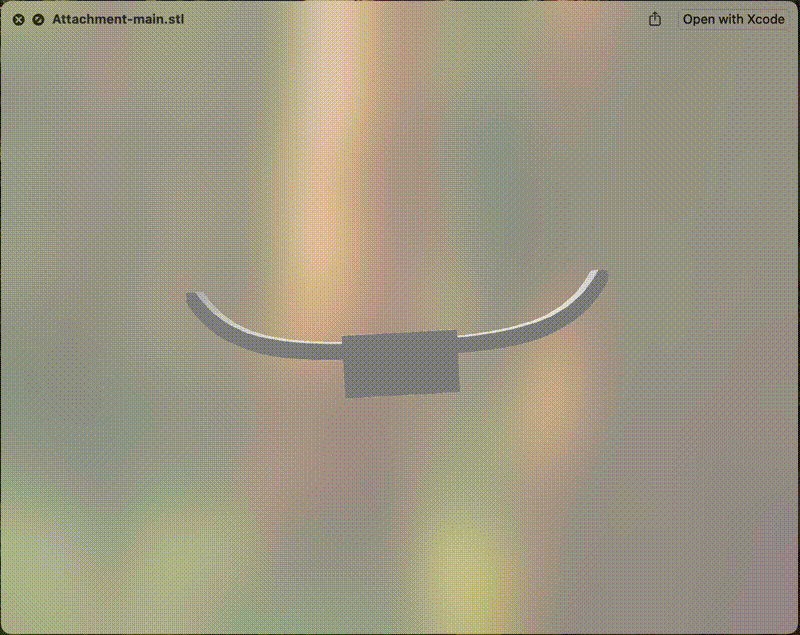
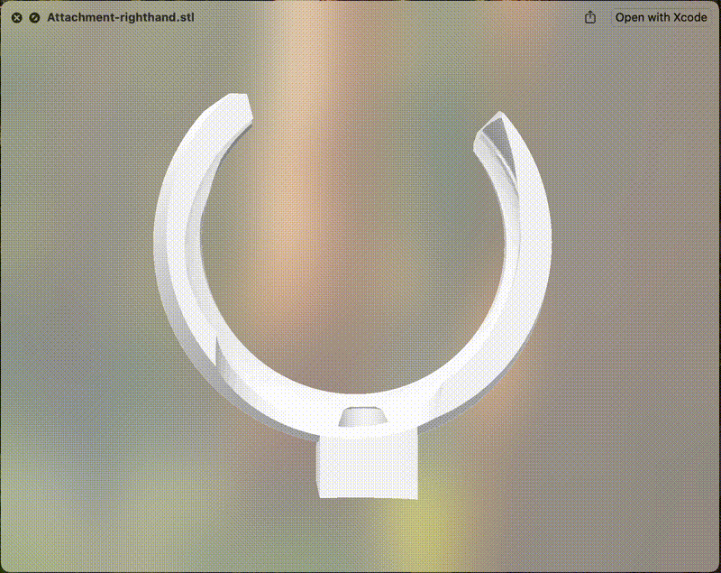

# Handheld-style HMD & Controller Attachments

This repository contains the 3D design files (in STL format) for a handheld-style attachment system for the Meta Quest 3. The design includes attachments for the headset as well as for both the left-hand and right-hand controllers.

## Project's Video

[]('https://youtu.be/eAdcVU5cGNM')

## Attachments Preview

<div align="start">
  
  
  
</div>

## Overview

This project provides 3D printable designs for attachments that convert a standard HMD (Meta Quest 3) and its controllers into a handheld system. The attachments are designed to be printed using common 3D printers and assembled with a 1/4-inch bolt.

## WARNING

Our implementation may damage hardware! You use our tools at your own risk and responsibility! If you don't like these terms, don't use this file!

## Files

- **Attachment-main.stl**: Attachment for the Meta Quest 3 headset.

  

- **Attachment-lefthand.stl**: Attachment for the left-hand controller.

  

- **Attachment-righthand.stl**: Attachment for the right-hand controller.

  

## Features

- **3D Printable Design**: STL files provided for easy 3D printing.
- **Simple Assembly**: Secure the printed parts with a 1/4-inch bolt.
- **Optimized for Meta Quest 3**: Specifically tailored for the headset and controllers.

## Requirements

- A 3D printer capable of printing the provided STL files.
- A 1/4-inch bolt for assembly.
- A Meta Quest 3 headset along with its left-hand and right-hand controllers.

## Assembly Instructions

1. **Download the Files**: Clone this repository or download the STL files directly.
2. **Print the Parts**: Use your preferred slicing software and 3D printer to print the attachments.
3. **Assemble**: Attach the printed parts to your Meta Quest 3 headset and controllers using a 1/4-inch bolt. Detailed assembly instructions will be provided soon.

## Publication

Yuki Abe*, Kan Kusakabe*, Myungguen Choi*, Daisuke Sakamoto, Tetsuo Ono. *Joint first authors. 2025. ACM CHI Conference on Human Factors in Computing Systems (CHI'2025), ACM.
https://doi.org/10.1145/3706598.3713874

If you use this project in your research, please cite our work as follows:

```bibtex
@inproceedings{handheldHMD2025,
  Coming Soon.
}
```
